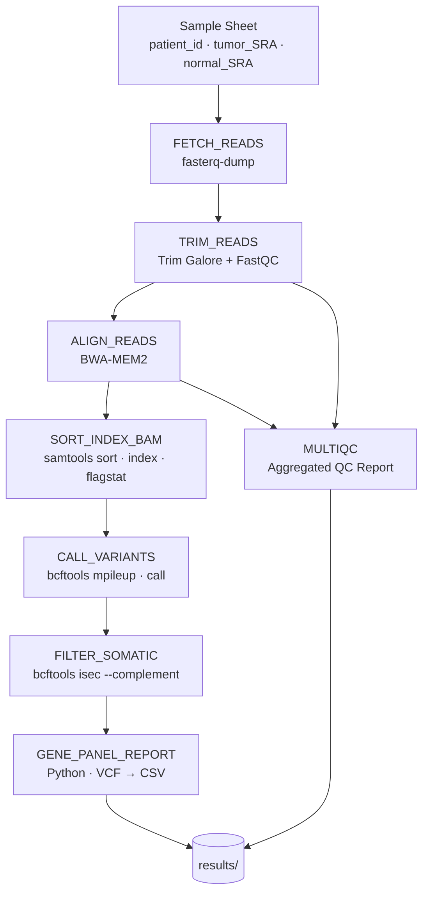

# nextflow-somatic-variant-demo

A modular **Nextflow DSL2** somatic variant calling pipeline for paired tumor/normal RNA-seq data. Identifies tumor-specific (somatic) mutations and maps them against a curated cancer gene panel (EGFR, KRAS, BRAF, and others).

Originally developed as a bash-based class project; modernized into a portable, reproducible Nextflow workflow with Docker and AWS Batch support.

---

## Pipeline Overview



---

## Repository Structure

```
nextflow-somatic-variant-demo/
├── main.nf                        # Main workflow entry point
├── nextflow.config                # Parameters, resource labels, profiles
├── samples.csv                    # Sample sheet (patient_id, tumor_SRA, normal_SRA)
├── assets/
│   └── cancer_gene_panel.json     # Curated cancer gene → RefSeq transcript map
└── modules/
    ├── fetch_reads.nf             # SRA download (fasterq-dump)
    ├── trim.nf                    # Quality trimming (Trim Galore)
    ├── align.nf                   # Read alignment (BWA-MEM2)
    ├── sort_index.nf              # BAM sort/index/flagstat (samtools)
    ├── variant_call.nf            # Variant calling (bcftools mpileup/call)
    ├── somatic_filter.nf          # Germline subtraction (bcftools isec)
    ├── gene_panel_analysis.nf     # Cancer gene mapping (Python/pyvcf)
    └── multiqc.nf                 # QC aggregation (MultiQC)
```

---

## Quick Start

### Prerequisites
- [Nextflow](https://www.nextflow.io/) ≥ 23.04
- Docker (for the `docker` profile) **or** tools installed locally

### Run locally (tools installed)
```bash
nextflow run main.nf -profile local
```

### Run with Docker
```bash
nextflow run main.nf -profile docker
```

### Run on AWS Batch
```bash
export TOWER_ACCESS_TOKEN=<your-seqera-token>

nextflow run main.nf \
    -profile awsbatch \
    -work-dir    s3://your-bucket/nextflow-work \
    --aws_region us-east-1 \
    --aws_queue  nextflow-bio-queue \
    --outdir     s3://your-bucket/results
```

`--aws_region` and `--aws_queue` default to the values in `nextflow.config`; override them here to target a different region or queue without editing the config.

### Resume a failed run
```bash
nextflow run main.nf -profile docker -resume
```

---

## Parameters

| Parameter      | Default                                              | Description                        |
|----------------|------------------------------------------------------|------------------------------------|
| `sample_sheet` | `samples.csv`                                        | CSV with patient_id, tumor/normal SRA accessions |
| `reference`    | `data/reference/GCF_000001405.40_GRCh38.p14_rna.fna`| Reference FASTA                    |
| `outdir`       | `results`                                            | Output directory (local or S3)     |
| `gene_panel`   | `assets/cancer_gene_panel.json`                      | Cancer gene panel JSON             |
| `max_cpus`     | `16`                                                 | Max CPUs per process               |
| `max_memory`   | `64.GB`                                              | Max memory per process             |
| `aws_region`   | `us-east-1`                                          | AWS region for Batch execution     |
| `aws_queue`    | `nextflow-batch-queue`                               | AWS Batch job queue name           |

Override any parameter at runtime:
```bash
nextflow run main.nf --outdir my_results --max_cpus 8 -profile docker
```

---

## Sample Sheet Format

```csv
patient_id,tumor_SRA,normal_SRA
LC_C1,ERR164550,ERR164473
LC_C7,ERR164556,ERR164477
```

---

## Output Structure

```
results/
├── raw_reads/          # Downloaded FASTQs per patient
├── trimmed/            # Trimmed reads + FastQC reports
├── aligned/            # BAM files + alignment logs
├── sorted_bam/         # Sorted/indexed BAMs + flagstat
├── variants/           # Per-sample BCF files (tumor + normal)
├── somatic_variants/   # Somatic-only VCFs (germline subtracted)
├── gene_panel/         # Per-patient mutation CSVs + reports
├── multiqc/            # Aggregated HTML QC report
└── pipeline_info/      # Nextflow timeline, DAG, execution report
```

---

## Engineering Highlights

- **Modular Nextflow DSL2** — each tool is an isolated process in `modules/`, independently testable and reusable
- **Wave + conda** — containers provisioned on-demand by [Seqera Wave](https://seqera.io/wave/) from conda specs; no hardcoded registry URIs
- **Multi-profile support** — `local`, `docker`, `awsbatch`, and `sge` profiles; switch with `-profile`
- **AWS Batch ready** — S3 working directory; region and queue configurable at runtime via `--aws_region` / `--aws_queue`
- **Seqera Platform monitoring** — Tower enabled by default; set `TOWER_ACCESS_TOKEN` to stream run progress to [cloud.seqera.io](https://cloud.seqera.io)
- **Built-in resume** — Nextflow caching means interrupted runs restart from the last successful step
- **Resource labels** — `low`/`medium`/`high` labels control CPU/memory per process, tunable without touching module code
- **Somatic variant strategy** — `bcftools isec --complement` subtracts germline variants (present in normal) from tumor calls, isolating true somatic mutations
- **Cancer gene panel** — externalized to JSON, easily extended; maps somatic variants to clinically relevant genes (EGFR, KRAS, BRAF, NRAS, PIK3CA, CTNNB1, MET)
- **Pipeline introspection** — Nextflow timeline, DAG, and execution report generated automatically

---

## Test Data

For local testing, small public datasets work well:

```bash
# Example: download a small lung cancer sample pair
fasterq-dump ERR164550 --split-files -X 100000   # tumor (first 100k reads)
fasterq-dump ERR164473 --split-files -X 100000   # normal
```

Reference: `GCF_000001405.40_GRCh38.p14_rna.fna` (human RNA reference, NCBI)

---

## Background

This pipeline is a Nextflow modernization of a somatic variant calling workflow originally written in bash and Python for a graduate bioinformatics course. The biological question: identifying somatic mutations in lung cancer transcriptomes by comparing tumor vs. matched normal tissue, then mapping findings to a panel of known cancer driver genes.
